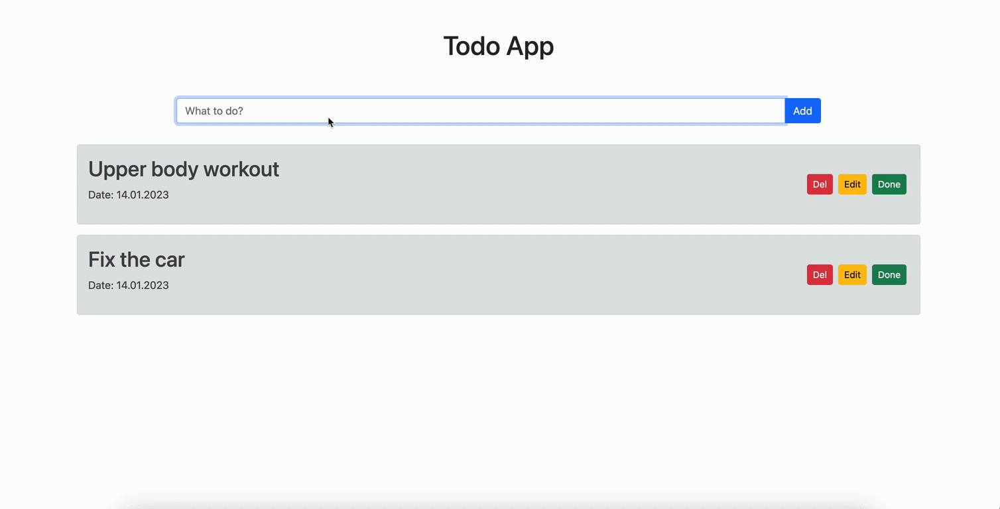

<h1>Todo App</h1>

<h5>This app is created with React.js</h5>
<ul>
    What's used:
    <li>function based components</li>
    <li>useState</li>
    <li>props with destructuring</li>
    <li>controlled inputs</li>
    <li>ES6 features (filter, map, spread operator (for object and arrays)</li>
    <li>conditional rendering</li>
    <li>window.confirm function</li>
    <li>bootstrap for styling</li>
</ul>

